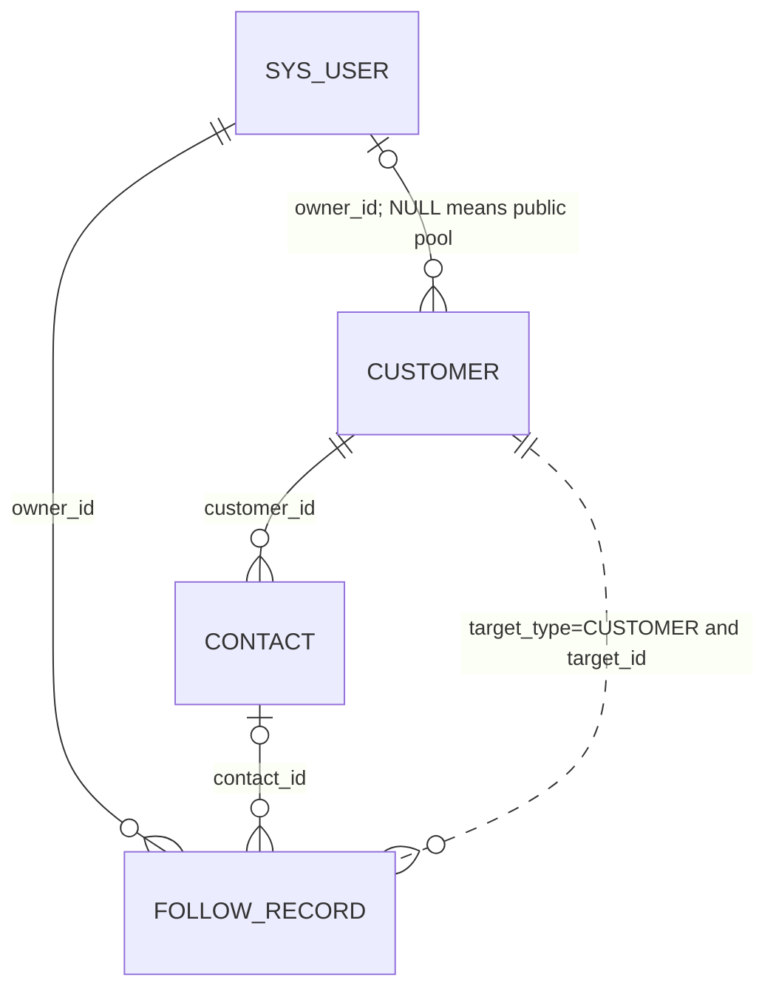

# Customer Management V1 Business Rules

## 1. Purpose

本文档是 Customer Management V1 的正式业务规则基线，供后续 schema development、后端实现、前端实现、权限设计、测试数据和测试用例设计共同遵循。

本文所称“V1”表示计划纳入第一版的能力，不表示功能已经实现。当前生产代码仍是最终实现事实来源；若实现与本文冲突，应先确认业务决策并同步修正文档或实现，不能静默偏离。

文档用语：

- **Frozen Business Rule**：本轮已经确认，后续实现必须遵循。
- **Planned Implementation**：V1 计划实现，但当前代码尚不存在。
- **Current Schema Fact**：当前 `database/init.sql` 已具备的结构事实。

## 2. V1 Scope

### Planned for V1

```text
客户管理
├── 客户列表
│   ├── 查看客户
│   ├── 新建客户
│   ├── 查看客户详情
│   └── 编辑客户
├── 公海客户
│   ├── 查看公海
│   └── 领取客户
├── 联系人管理
│   ├── 联系人列表
│   ├── 新建联系人
│   ├── 编辑联系人
│   └── 删除联系人
└── 跟进记录
    ├── 跟进记录列表
    └── 新建跟进记录
```

### Deferred / Future

- 客户删除、客户转移、批量分配、批量导入和客户合并
- 自动公海回收、保护期、客户容量、领取次数、审批和领取历史
- 部门/组织树数据权限以及 `DEPT`、`DEPT_AND_CHILD`、`CUSTOM` 范围
- 复杂客户分配历史和客户操作历史
- 联系人独立负责人
- 跟进记录编辑和删除
- 复杂审批、字段级权限、客户活动时间线

## 3. Domain Model



- **Current Schema Fact**：Customer 与 Contact 是一对多关系；Contact 必须属于一个 Customer。
- **Current Schema Fact**：Customer owner 可为空；空值表示公海客户。
- **Current Schema Fact**：FollowRecord 保留 `target_type + target_id` 多态目标，并可选关联一个 Contact。
- **Frozen Business Rule**：Customer V1 页面只创建 `target_type=CUSTOMER` 的跟进；Clue 和 Business 后续复用相同跟进表。

## 4. Customer Ownership

- **Frozen Business Rule**：`customer.owner_id` 表示客户当前负责人。
- `owner_id IS NOT NULL`：已分配客户。
- `owner_id IS NULL`：公海客户。
- 客户归属与客户生命周期状态相互独立；禁止用 `PUBLIC`、`POOL` 等 `customer.status` 值表达公海。
- V1 不增加 `is_public`、`pool_status`、前负责人、入池时间、领取时间或分配历史。
- **Planned Implementation**：后端必须根据当前认证用户和规则决定 owner，不能信任普通前端提交的 `owner_id`。

## 5. Public Pool

### Visibility and claim roles

| Role | View public pool | Claim customer |
|---|---:|---:|
| SUPER_ADMIN | Yes | No |
| SYSTEM_ADMIN | Yes | No |
| SALES_MANAGER | Yes | Yes |
| SALES_STAFF | Yes | Yes |

系统治理角色拥有较高系统权限，不代表其自动参与销售业务。

### Claim transition

```text
owner_id = NULL
    ↓ SALES_MANAGER / SALES_STAFF claims
owner_id = currentUserId
    ↓
customer leaves public pool
```

- **Frozen Business Rule**：V1 不实现自动回收、容量限制、保护期、领取历史或抢单日志。
- **Planned Implementation**：查看公海需要独立功能权限，并始终使用 `owner_id IS NULL` 判断。

## 6. Role and Data Scope Matrix

V1 仅采用 `ALL` 和 `SELF`。当前没有部门表，`DEPT`、`DEPT_AND_CHILD`、`CUSTOM` 不进入 Customer V1。

| Feature | SUPER_ADMIN | SYSTEM_ADMIN | SALES_MANAGER | SALES_STAFF |
|---|---|---|---|---|
| 查看客户 | ALL | ALL | ALL | SELF |
| 新建客户 | Yes | Yes | Yes | Yes |
| 编辑客户 | ALL | ALL | ALL | SELF |
| 查看公海 | Yes | Yes | Yes | Yes |
| 领取公海 | No | No | Yes | Yes |
| 查看联系人 | ALL | ALL | ALL | 所属 SELF 客户 |
| 新建联系人 | ALL | ALL | ALL | 所属 SELF 客户 |
| 编辑联系人 | ALL | ALL | ALL | 所属 SELF 客户 |
| 删除联系人 | ALL | ALL | ALL | 所属 SELF 客户 |
| 查看跟进记录 | ALL | ALL | ALL | 所属 SELF 客户 |
| 新建跟进记录 | No | No | Yes | Yes |

- `SELF`：仅允许访问 `customer.owner_id = currentUserId` 的已分配客户。
- `ALL`：普通已分配客户查询不按 owner 限制。
- 公海不归入 `SELF` 或普通 `ALL` 查询语义，由独立公海权限和 `owner_id IS NULL` 决定。
- **Planned Implementation**：该矩阵尚未接入 Customer Service，不能把 `sys_role.data_scope` 字段存在误述为已实现数据权限。

## 7. Customer Creation

| Creator role | Owner after creation |
|---|---|
| SALES_MANAGER | currentUserId |
| SALES_STAFF | currentUserId |
| SUPER_ADMIN | NULL，默认进入公海 |
| SYSTEM_ADMIN | NULL，默认进入公海 |

- V1 不支持创建客户时指定其他销售人员。
- owner 必须由后端根据当前操作者设置，不接受前端越权指定。
- 创建 Customer 不要求同时创建 Contact。

## 8. Functional Permission Baseline

以下权限码是 **Planned Implementation**，当前尚未写入 `sys_permission`，也没有对应接口或 `@PreAuthorize`：

| Domain | Planned permission codes |
|---|---|
| Customer | `customer:list`, `customer:create`, `customer:update` |
| Public pool | `customer_pool:list`, `customer_pool:claim` |
| Contact | `contact:list`, `contact:create`, `contact:update`, `contact:delete` |
| Follow record | `follow:list`, `follow:create` |

不单独创建 `customer:detail`。详情读取复用 `customer:list`，并执行对象/数据范围校验。V1 不创建 `customer:delete`、`follow:update` 或 `follow:delete`。

## 9. Customer Attributes

### Type

| Value | Meaning |
|---|---|
| ENTERPRISE | 企业客户 |
| INDIVIDUAL | 个人客户 |

默认值为 `ENTERPRISE`。

### Status

| Value | Meaning |
|---|---|
| POTENTIAL | 已建立档案，处于需求培育或初步关系阶段 |
| ACTIVE | 存在有效业务关系或持续业务往来 |
| INACTIVE | 当前不再重点跟进或长期无有效业务 |

`customer.status` 不表示是否在公海。三种状态均允许搭配 owner 为空或非空。

### Level

| Value | Meaning |
|---|---|
| A | 重点客户 |
| B | 重要客户 |
| C | 普通客户 |
| D | 低优先级客户 |
| NULL | 尚未评级 |

### Industry and source

V1 继续使用 VARCHAR，不增加字典表、数据库枚举或 CHECK。以下为 application-level candidate values，不是数据库强约束：

- Industry：制造业、信息技术、金融、教育、医疗、零售、建筑、物流、其他。
- Source：官网咨询、电话营销、客户推荐、线下活动、线上推广、销售开发、其他。

未来引入字典管理后再统一治理。

## 10. Customer Number and Duplicate Rules

- `customer_no` 由系统生成、全局唯一、用户不可指定、创建后不可修改、逻辑删除后不复用。
- 具体生成算法在 Customer Create 实现任务中确定；禁止使用存在并发风险的 `COUNT + 1` 作为最终方案。
- `customer_name`、`phone`、`email` 不设置唯一约束。
- V1 允许同名客户和共享联系电话，不因名称重复直接拒绝保存。
- V1 不实现智能去重、客户合并或统一社会信用代码查重；后续可提供同名/相似客户提示。

## 11. Contact Rules

- Customer : Contact = 1 : N。
- 一个 Customer 可有 0、1 或多个 Contact。
- Contact 必须属于且只能属于一个 Customer，不允许脱离 Customer 独立存在。
- Contact 没有独立 owner，其访问范围继承所属 Customer。
- 创建 Customer 不要求同时创建 Contact。

## 12. Primary Contact

- 一个 Customer 允许 0 或 1 个 `is_primary=1` 的 Contact，禁止同时存在多个主要联系人。
- 将联系人 B 设置为主要联系人时，必须在同一事务中先将同一 Customer 原主要联系人 A 更新为 `is_primary=0`，再将 B 设置为 1。
- **Current Schema Fact**：数据库没有唯一约束强制此规则。
- **Planned Implementation**：未来 Service 必须在事务中维护该不变量，并考虑并发写入。

## 13. Contact Deletion

- V1 的联系人删除是逻辑删除，`deleted=1`。
- 删除和查询前必须验证所属 Customer 的访问范围。
- 父 Customer 已逻辑删除时，子 Contact 不应作为正常 Customer Management 数据展示。
- 若 Contact 已被未删除 Business 引用，原则上不能造成业务引用异常；**Future cross-module consistency check required**。

## 14. Follow Record Rules

### Target

- 保留 `target_type` 的 CUSTOMER、CLUE、BUSINESS 三种值和 `target_id` 多态结构。
- Customer V1 只创建 `target_type=CUSTOMER AND target_id=customer.id` 的记录。
- 客户跟进历史只包含上述 CUSTOMER 记录，不自动合并 Clue 或 Business 跟进。

### Contact

- `contact_id` 可为空，表示本次跟进未指定具体联系人。
- 非空时表示本次跟进涉及的具体联系人，不把 CONTACT 加入 `target_type`。
- 当目标为 Customer A 且联系人为 Contact B 时，未来 Service 必须验证 `B.customer_id == A.id`，否则拒绝。

### Owner and creator

- `follow_record.owner_id` 是实际执行本次跟进的销售人员。
- `created_by` 是在系统中创建记录的用户。
- 两者通常相同，但为经理代录、系统导入等场景保留不同语义，不能合并。
- SALES_MANAGER、SALES_STAFF 创建时 owner 由后端固定为 currentUserId。
- SUPER_ADMIN、SYSTEM_ADMIN 不允许新建跟进记录。

### Time and lifecycle

- `follow_at` 表示实际跟进时间；`next_follow_at` 可为空，表示没有明确下次跟进时间。
- V1 只提供列表和新增，不提供编辑或删除。
- 所有查询默认排除 `deleted=1`，即使 V1 没有跟进删除入口。

## 15. Authorization Model

Customer Management 必须采用双层后端授权：

1. **Method-level functional authorization**：检查 `customer:list`、`customer:update`、`contact:update` 等功能权限。
2. **Object/Data Scope authorization**：根据角色、owner 和目标 Customer 再检查对象范围。

例如 SALES_STAFF 即使拥有 `customer:update`，也只能修改 `customer.owner_id=currentUserId` 的客户。联系人权限继承所属 Customer；跟进记录权限由所属 Customer 范围和当前业务角色共同决定。

前端的菜单、路由和按钮隐藏只改善 UX，不是安全边界。后端 Controller/Service 必须执行真实授权。

## 16. Logical Deletion and Lifecycle

- Customer V1 不提供客户删除；不再使用的客户以 `status=INACTIVE` 表达。
- Contact 删除采用逻辑删除。
- FollowRecord V1 不提供删除。
- 列表查询必须默认排除 `deleted=1`。
- Contact 查询必须同时验证父 Customer 可访问；父 Customer 已删除时不展示子 Contact。
- 客户被 Contact、Business、Contract 和 FollowRecord 引用，其完整删除生命周期留待单独设计。

## 17. Concurrency Rules

### Public-pool claim

领取必须是原子条件更新，不能把“先查询 owner 再普通更新”作为唯一并发保护。未来实现语义：

```sql
UPDATE customer
SET owner_id = ?
WHERE id = ?
  AND owner_id IS NULL
  AND deleted = 0;
```

- 影响 1 行：领取成功。
- 影响 0 行：客户不存在、已删除或已被其他销售领取；Service 应返回稳定业务结果。

### Other transactional invariants

- 主要联系人切换必须在同一事务中完成。
- FollowRecord 的 Customer/Contact 一致性必须在写入前验证。
- Customer 创建时编号生成必须并发安全。

## 18. Deferred Features

除第 2 节列出的范围外，下列审查发现也暂不调整：客户简称、网站、统一社会信用代码、联系人 department/wechat、数据库字典约束、客户分配历史、Business stage/status 重叠、Business Contact/Customer 跨字段约束、Contract Business/Customer 跨字段约束和额外索引优化。

## 19. Schema Changes for V1

本轮仅批准并已写入 `database/init.sql` 的两项 schema 变化：

1. `customer.owner_id BIGINT NULL`，保留 `fk_customer_owner → sys_user(id)` 和原索引；NULL 是公海客户。
2. `follow_record.contact_id BIGINT NULL`，新增 `fk_follow_record_contact → contact(id)`；表示可选的被跟进联系人。

没有增加公海状态、历史表或其他业务字段。`target_type + target_id`、`follow_record.owner_id` 及原索引保持不变。

## 20. Implementation Notes

- 当前尚未实现 Customer/Contact/FollowRecord Entity、Mapper、Service、Controller、前端页面、权限数据或测试数据。
- 业务 Long/BIGINT ID 对前端应继续按 string 输出。
- Customer、Contact、FollowRecord 的 Entity 应按现有全局约定映射逻辑删除和乐观锁。
- owner、数据范围、父对象访问和多态目标校验必须由后端完成。
- 正式开发前应先生成对应测试用例；实现写操作时确保授权失败无副作用。
- 对现有开发数据库的结构升级必须由用户手动执行一次性 ALTER SQL；修改 `init.sql` 本身不会升级已有实例。

