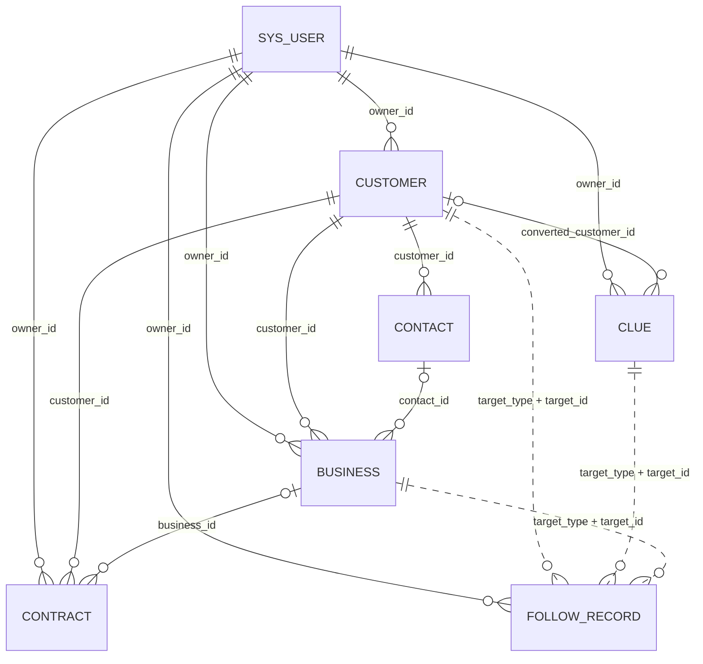

# CRM Business Data Model Review

## 1. Review Scope

本报告是客户管理 V1 开发前的只读数据模型审查，覆盖：

- `customer`
- `contact`
- `follow_record`
- `clue`
- `business`
- `contract`
- 与上述表直接关联的 `sys_user`，以及数据范围来源 `sys_role.data_scope`

事实来源按本次审查的优先级为：`database/init.sql`、当前后端代码与配置、资源 SQL、前端占位路由、自动化测试、`docs/CODEX_CONTEXT.md`。

标记约定：

- **FACT**：可由当前 SQL、代码或配置直接确认。
- **INFERENCE**：从结构可以合理推断，但没有实现或业务规则确认。
- **DECISION REQUIRED**：开始 Customer V1 前需要项目负责人明确。

本报告描述的是仓库内 schema 定义；未连接运行中的 MySQL 执行 `SHOW CREATE TABLE`，因此不能证明某个既有数据库实例已经与 `init.sql` 完全同步。

## 2. Current Business Data Model

**FACT**：当前六张业务表只存在于 `database/init.sql`。后端没有对应 Entity、Mapper、Service、Controller 或业务测试；前端相关入口全部指向 `Placeholder.vue`，没有业务 type 或 API。

实线表示数据库外键；虚线表示由 `target_type + target_id` 表达、必须由未来 Service 校验的多态逻辑关系。所有 `created_by`、`updated_by` 都是裸 `BIGINT`，没有指向 `sys_user` 的数据库外键，未在图中画出。

### Cross-table structural facts

- **FACT**：六表主键均为 `BIGINT NOT NULL`，但均未声明 `AUTO_INCREMENT`。
- **FACT**：六表都具有一致的 `created_by`、`updated_by`、`created_at`、`updated_at`、`deleted`、`version` 字段。
- **FACT**：六表都支持逻辑删除字段和乐观锁版本字段；但尚无 Entity，所以 `@TableLogic`、`@Version`、`@TableId` 尚未落到业务模型。
- **FACT**：MyBatis-Plus 全局配置为 `id-type: assign_id`，并配置全局逻辑删除字段 `deleted`，同时启用了乐观锁插件。
- **INFERENCE**：未来若业务 Entity 沿用当前全局配置，主键适合由 MyBatis-Plus 分配雪花 ID；但在 Entity 建立之前，不能称其为已经实现的业务主键策略。
- **FACT**：按项目现行精度约定，业务 `BIGINT` ID 暴露给 Vue 时应使用 `string`，避免 JavaScript Number 精度丢失。

## 3. Customer

### Fields

| Field | DB Type | Nullable | Default | Key/Index | Related Table | Current Meaning |
|---|---|---:|---|---|---|---|
| id | BIGINT | No | None | PK | — | 客户主键 |
| customer_no | VARCHAR(32) | No | None | UNIQUE `uk_customer_no` | — | 客户编号 |
| customer_name | VARCHAR(200) | No | None | INDEX `idx_customer_name` | — | 客户全称；未发现简称字段 |
| customer_type | VARCHAR(32) | No | `ENTERPRISE` | — | — | 客户类型，注释定义 ENTERPRISE/INDIVIDUAL |
| customer_level | VARCHAR(16) | Yes | NULL | — | — | 客户等级，注释定义 A/B/C/D |
| industry | VARCHAR(64) | Yes | NULL | — | — | 行业；取值集合未定义 |
| source | VARCHAR(64) | Yes | NULL | — | — | 客户来源；取值集合未定义 |
| phone | VARCHAR(32) | Yes | NULL | — | — | 客户联系电话 |
| email | VARCHAR(128) | Yes | NULL | — | — | 客户邮箱 |
| province | VARCHAR(64) | Yes | NULL | — | — | 省份 |
| city | VARCHAR(64) | Yes | NULL | — | — | 城市 |
| address | VARCHAR(500) | Yes | NULL | — | — | 详细地址 |
| owner_id | BIGINT | No | None | Composite index `(owner_id,status,deleted)`; FK | sys_user.id | 当前负责人 |
| status | VARCHAR(32) | No | `POTENTIAL` | Composite index `(owner_id,status,deleted)` | — | 客户状态，注释定义 POTENTIAL/ACTIVE/INACTIVE |
| remark | VARCHAR(1000) | Yes | NULL | — | — | 备注 |
| created_by | BIGINT | No | None | — | Logical sys_user, no FK | 创建人 ID；数据库不保证用户存在 |
| updated_by | BIGINT | No | None | — | Logical sys_user, no FK | 最后更新人 ID；数据库不保证用户存在 |
| created_at | DATETIME(3) | No | CURRENT_TIMESTAMP(3) | — | — | 创建时间 |
| updated_at | DATETIME(3) | No | CURRENT_TIMESTAMP(3), auto update | — | — | 最后更新时间 |
| deleted | TINYINT | No | 0 | Composite index `(owner_id,status,deleted)` | — | 逻辑删除标记；全局约定 0 有效、1 删除 |
| version | INT | No | 0 | — | — | 乐观锁版本 |

### Indexes, foreign keys, and semantics

- **FACT**：客户编号唯一；客户名称只有普通索引，名称、电话、邮箱均不唯一，也没有统一社会信用代码字段。
- **FACT**：存在客户类型、等级、行业、来源和状态；不存在 `short_name`、`website`、统一社会信用代码。
- **FACT**：没有 `last_follow_time`、`next_follow_time` 或 `follow_status` 等跟进汇总字段。
- **FACT**：`owner_id` 是非空外键，数据库强制每个客户绑定现存 `sys_user`。
- **FACT**：没有 `pool_status`、`is_public`、`customer_pool`、进入公海时间、领取时间、前负责人或领取/分配历史字段/表。
- **DECISION REQUIRED**：当前结构无法表达“无负责人客户”。如果 V1 必须实现公海，必须先确定公海的持久化表达方式；不能在现有 schema 下默认 `owner_id IS NULL`，因为该列明确 `NOT NULL`。

## 4. Contact

### Fields

| Field | DB Type | Nullable | Default | Key/Index | Related Table | Current Meaning |
|---|---|---:|---|---|---|---|
| id | BIGINT | No | None | PK | — | 联系人主键 |
| customer_id | BIGINT | No | None | Composite index `(customer_id,deleted)`; FK | customer.id | 所属客户 |
| contact_name | VARCHAR(64) | No | None | — | — | 联系人姓名 |
| gender | TINYINT | Yes | NULL | — | — | 性别，注释定义 0未知/1男/2女 |
| position | VARCHAR(64) | Yes | NULL | — | — | 职位 |
| mobile | VARCHAR(32) | Yes | NULL | INDEX `idx_contact_mobile` | — | 手机号 |
| telephone | VARCHAR(32) | Yes | NULL | — | — | 固定电话或其他电话号码；更细语义未确认 |
| email | VARCHAR(128) | Yes | NULL | — | — | 邮箱 |
| is_primary | TINYINT | No | 0 | — | — | 是否主要联系人；具体合法值未由 CHECK 约束 |
| decision_role | VARCHAR(32) | Yes | NULL | — | — | 决策角色，注释定义 DECISION/INFLUENCER/USER/OTHER |
| birthday | DATE | Yes | NULL | — | — | 生日 |
| remark | VARCHAR(500) | Yes | NULL | — | — | 备注 |
| created_by | BIGINT | No | None | — | Logical sys_user, no FK | 创建人 ID |
| updated_by | BIGINT | No | None | — | Logical sys_user, no FK | 更新人 ID |
| created_at | DATETIME(3) | No | CURRENT_TIMESTAMP(3) | — | — | 创建时间 |
| updated_at | DATETIME(3) | No | CURRENT_TIMESTAMP(3), auto update | — | — | 更新时间 |
| deleted | TINYINT | No | 0 | Composite index `(customer_id,deleted)` | — | 逻辑删除标记 |
| version | INT | No | 0 | — | — | 乐观锁版本 |

### Relationship assessment

1. **FACT**：一个 customer 可由多条 contact 记录引用，因此支持一对多联系人。
2. **FACT**：`is_primary` 可标记主要联系人，但没有唯一约束保证同一客户最多一个主要联系人。
3. **FACT**：没有联系人姓名、手机号或 `(customer_id, mobile)` 唯一约束。
4. **FACT**：外键没有 `ON DELETE CASCADE`；物理删除被联系人引用的客户时，MySQL 默认会拒绝。客户逻辑删除不会自动改变联系人。
5. **FACT**：contact 没有 `owner_id`；只有无 FK 的 `created_by`、`updated_by` 人员字段。
6. **FACT**：`customer_id NOT NULL` 且有 FK，因此联系人不能脱离客户独立存在。
7. **FACT**：没有 department、wechat、contact status 字段。
8. **DECISION REQUIRED**：是否允许多个 `is_primary=1`，以及客户逻辑删除后联系人应如何展示/处理，当前未定义。

## 5. Follow Record

### Fields

| Field | DB Type | Nullable | Default | Key/Index | Related Table | Current Meaning |
|---|---|---:|---|---|---|---|
| id | BIGINT | No | None | PK | — | 跟进记录主键 |
| target_type | VARCHAR(32) | No | None | Composite index `(target_type,target_id,follow_at)` | Logical customer/clue/business | 目标类型，注释定义 CUSTOMER/CLUE/BUSINESS |
| target_id | BIGINT | No | None | Composite index `(target_type,target_id,follow_at)` | Logical target selected by target_type | 多态业务对象 ID，由未来 Service 校验；无 DB FK |
| follow_type | VARCHAR(32) | No | None | — | — | 跟进方式，注释定义 PHONE/VISIT/EMAIL/IM/OTHER |
| content | TEXT | No | None | — | — | 跟进内容 |
| follow_at | DATETIME(3) | No | None | Composite index `(target_type,target_id,follow_at)` | — | 实际跟进时间 |
| next_follow_at | DATETIME(3) | Yes | NULL | Composite index `(owner_id,next_follow_at,deleted)` | — | 下次跟进时间 |
| owner_id | BIGINT | No | None | Composite index `(owner_id,next_follow_at,deleted)`; FK | sys_user.id | 跟进记录负责人/执行人；名称暗示 owner，但具体人员语义未明确注释 |
| created_by | BIGINT | No | None | — | Logical sys_user, no FK | 创建人 ID |
| updated_by | BIGINT | No | None | — | Logical sys_user, no FK | 更新人 ID |
| created_at | DATETIME(3) | No | CURRENT_TIMESTAMP(3) | — | — | 创建时间 |
| updated_at | DATETIME(3) | No | CURRENT_TIMESTAMP(3), auto update | — | — | 更新时间 |
| deleted | TINYINT | No | 0 | Composite index `(owner_id,next_follow_at,deleted)` | — | 逻辑删除标记 |
| version | INT | No | 0 | — | — | 乐观锁版本 |

### Capability assessment

- **FACT**：可直接逻辑关联 customer、clue、business；不能关联 contact，因为 `target_type` 注释不含 CONTACT，也没有 `contact_id`。
- **FACT**：没有数据库外键保证 `target_id` 存在、类型正确或未删除；注释明确要求 Service 校验，而该 Service 尚不存在。
- **FACT**：支持跟进方式、跟进时间和下一次跟进时间。
- **FACT**：以 `(CUSTOMER, customer.id)` 查询可以获得该客户的直接跟进历史。
- **FACT**：对商机/线索的跟进不会天然出现在按 CUSTOMER 目标查询的结果中；若要形成“客户完整历史”，需要未来查询明确是否合并关联商机记录。
- **DECISION REQUIRED**：`owner_id` 是“实际跟进人”还是“记录负责人”；`created_by` 与其何时允许不同，当前无法确认。
- **DECISION REQUIRED**：Customer V1 的跟进是否必须或允许指定具体联系人，当前 schema 不支持这一关系。

## 6. Clue

### Fields

| Field | DB Type | Nullable | Default | Key/Index | Related Table | Current Meaning |
|---|---|---:|---|---|---|---|
| id | BIGINT | No | None | PK | — | 线索主键 |
| clue_no | VARCHAR(32) | No | None | UNIQUE `uk_clue_no` | — | 线索编号 |
| clue_name | VARCHAR(100) | No | None | — | — | 线索名称/联系人名称；更细语义未确认 |
| company_name | VARCHAR(200) | Yes | NULL | — | — | 公司名称 |
| mobile | VARCHAR(32) | Yes | NULL | INDEX `idx_clue_mobile` | — | 手机号 |
| email | VARCHAR(128) | Yes | NULL | — | — | 邮箱 |
| source | VARCHAR(64) | Yes | NULL | — | — | 线索来源；取值未定义 |
| industry | VARCHAR(64) | Yes | NULL | — | — | 行业；取值未定义 |
| owner_id | BIGINT | No | None | Composite index `(owner_id,status,deleted)`; FK | sys_user.id | 线索负责人 |
| status | VARCHAR(32) | No | `NEW` | Composite index `(owner_id,status,deleted)` | — | NEW/FOLLOWING/CONVERTED/INVALID |
| converted_customer_id | BIGINT | Yes | NULL | FK; supporting index may be created by InnoDB | customer.id | 转化后的客户 |
| converted_at | DATETIME(3) | Yes | NULL | — | — | 转化时间 |
| invalid_reason | VARCHAR(500) | Yes | NULL | — | — | 失效原因 |
| remark | VARCHAR(1000) | Yes | NULL | — | — | 备注 |
| created_by | BIGINT | No | None | — | Logical sys_user, no FK | 创建人 ID |
| updated_by | BIGINT | No | None | — | Logical sys_user, no FK | 更新人 ID |
| created_at | DATETIME(3) | No | CURRENT_TIMESTAMP(3) | — | — | 创建时间 |
| updated_at | DATETIME(3) | No | CURRENT_TIMESTAMP(3), auto update | — | — | 更新时间 |
| deleted | TINYINT | No | 0 | Composite index `(owner_id,status,deleted)` | — | 逻辑删除标记 |
| version | INT | No | 0 | — | — | 乐观锁版本 |

### Conversion assessment

- **FACT**：`converted_customer_id` 和 `converted_at` 明确记录 Clue → Customer 转化关系，且目标客户受外键约束。
- **FACT**：数据库没有约束 `status=CONVERTED` 时两个转化字段必须存在，也没有约束非 CONVERTED 状态时必须为空。
- **FACT**：`converted_customer_id` 不唯一，允许多个线索转化/归并到同一客户。
- **INFERENCE**：schema 可以表达基本转化结果，但转化事务、字段复制、重复客户检查和状态一致性都必须由未来 Service 定义并保证。

## 7. Business

### Fields

| Field | DB Type | Nullable | Default | Key/Index | Related Table | Current Meaning |
|---|---|---:|---|---|---|---|
| id | BIGINT | No | None | PK | — | 商机主键 |
| business_no | VARCHAR(32) | No | None | UNIQUE `uk_business_no` | — | 商机编号 |
| business_name | VARCHAR(200) | No | None | — | — | 商机名称 |
| customer_id | BIGINT | No | None | INDEX `idx_business_customer`; FK | customer.id | 所属客户 |
| contact_id | BIGINT | Yes | NULL | FK; supporting index may be created by InnoDB | contact.id | 关联联系人，可为空 |
| owner_id | BIGINT | No | None | Composite index `(owner_id,stage,deleted)`; FK | sys_user.id | 商机负责人 |
| stage | VARCHAR(32) | No | None | Composite index `(owner_id,stage,deleted)` | — | DISCOVERY/PROPOSAL/NEGOTIATION/WON/LOST |
| amount | DECIMAL(18,2) | No | 0.00 | CHECK amount >= 0 | — | 预计或商机金额；字段未明确区分口径 |
| probability | DECIMAL(5,2) | No | 0.00 | CHECK 0..100 | — | 成交概率百分比 |
| expected_close_date | DATE | Yes | NULL | — | — | 预计成交日期 |
| actual_close_date | DATE | Yes | NULL | — | — | 实际成交/关闭日期 |
| status | VARCHAR(32) | No | `OPEN` | — | — | OPEN/WON/LOST |
| loss_reason | VARCHAR(500) | Yes | NULL | — | — | 输单原因 |
| remark | VARCHAR(1000) | Yes | NULL | — | — | 备注 |
| created_by | BIGINT | No | None | — | Logical sys_user, no FK | 创建人 ID |
| updated_by | BIGINT | No | None | — | Logical sys_user, no FK | 更新人 ID |
| created_at | DATETIME(3) | No | CURRENT_TIMESTAMP(3) | — | — | 创建时间 |
| updated_at | DATETIME(3) | No | CURRENT_TIMESTAMP(3), auto update | — | — | 更新时间 |
| deleted | TINYINT | No | 0 | Composite index `(owner_id,stage,deleted)` | — | 逻辑删除标记 |
| version | INT | No | 0 | — | — | 乐观锁版本 |

### Relationship assessment

1. **FACT**：Business 是销售商机/Opportunity，而不是通用业务对象。
2. **FACT**：`customer_id NOT NULL`，每个商机必须属于客户。
3. **FACT**：可以可选关联联系人。
4. **FACT**：必须关联销售负责人。
5. **FACT**：可表达销售阶段、金额、概率、预计和实际成交日期。
6. **FACT**：数据库不能保证 `contact_id` 所属客户与 `customer_id` 相同。
7. **DECISION REQUIRED**：`stage` 已含 WON/LOST，而 `status` 也含 WON/LOST；两者的职责与一致性规则尚未定义。

## 8. Contract

### Fields

| Field | DB Type | Nullable | Default | Key/Index | Related Table | Current Meaning |
|---|---|---:|---|---|---|---|
| id | BIGINT | No | None | PK | — | 合同主键 |
| contract_no | VARCHAR(64) | No | None | UNIQUE `uk_contract_no` | — | 合同编号 |
| contract_name | VARCHAR(200) | No | None | — | — | 合同名称 |
| customer_id | BIGINT | No | None | Composite index `(customer_id,status,deleted)`; FK | customer.id | 签约客户 |
| business_id | BIGINT | Yes | NULL | FK; supporting index may be created by InnoDB | business.id | 来源商机，可为空 |
| owner_id | BIGINT | No | None | INDEX `idx_contract_owner`; FK | sys_user.id | 合同负责人 |
| amount | DECIMAL(18,2) | No | None | CHECK amount >= 0 | — | 合同金额 |
| sign_date | DATE | Yes | NULL | — | — | 签署日期 |
| start_date | DATE | Yes | NULL | CHECK with end_date | — | 合同开始日期 |
| end_date | DATE | Yes | NULL | CHECK end >= start | — | 合同结束日期 |
| status | VARCHAR(32) | No | `DRAFT` | Composite index `(customer_id,status,deleted)` | — | DRAFT/APPROVING/ACTIVE/COMPLETED/VOID |
| file_url | VARCHAR(500) | Yes | NULL | — | — | 合同文件地址 |
| remark | VARCHAR(1000) | Yes | NULL | — | — | 备注 |
| created_by | BIGINT | No | None | — | Logical sys_user, no FK | 创建人 ID |
| updated_by | BIGINT | No | None | — | Logical sys_user, no FK | 更新人 ID |
| created_at | DATETIME(3) | No | CURRENT_TIMESTAMP(3) | — | — | 创建时间 |
| updated_at | DATETIME(3) | No | CURRENT_TIMESTAMP(3), auto update | — | — | 更新时间 |
| deleted | TINYINT | No | 0 | Composite index `(customer_id,status,deleted)` | — | 逻辑删除标记 |
| version | INT | No | 0 | — | — | 乐观锁版本 |

### Relationship assessment

- **FACT**：合同必须直接属于 Customer，Business 关联可为空，因此数据库允许不经过商机直接建立合同。
- **FACT**：当 `business_id` 非空时，数据库只保证商机存在，不能保证该商机的 `customer_id` 与合同的 `customer_id` 一致。
- **FACT**：合同必须有 owner/user；金额非负；日期约束只保证 end 不早于 start。
- **INFERENCE**：Customer → Business → Contract 和 Customer → Contract 两条路径都能表达；跨字段业务一致性需未来 Service 保证。

## 9. Relationship Matrix

| From | Field | To | Cardinality supported | Enforcement | Notes |
|---|---|---|---|---|---|
| customer | owner_id | sys_user.id | Many customers → one user | DB FK | owner 必填 |
| contact | customer_id | customer.id | Many contacts → one customer | DB FK | contact 不能独立存在 |
| clue | owner_id | sys_user.id | Many clues → one user | DB FK | owner 必填 |
| clue | converted_customer_id | customer.id | Many clues → zero/one customer | DB FK | conversion 可为空 |
| business | customer_id | customer.id | Many businesses → one customer | DB FK | customer 必填 |
| business | contact_id | contact.id | Many businesses → zero/one contact | DB FK | 不保证 contact 与 customer 一致 |
| business | owner_id | sys_user.id | Many businesses → one user | DB FK | owner 必填 |
| follow_record | target_type + target_id | customer/clue/business | Many records → one polymorphic target | Service only, not implemented | 不支持 contact target |
| follow_record | owner_id | sys_user.id | Many records → one user | DB FK | 具体人员语义待确认 |
| contract | customer_id | customer.id | Many contracts → one customer | DB FK | customer 必填 |
| contract | business_id | business.id | Many contracts → zero/one business | DB FK | business 可为空 |
| contract | owner_id | sys_user.id | Many contracts → one user | DB FK | owner 必填 |
| all six tables | created_by/updated_by | sys_user.id | Logical audit relation | No DB FK | 可保存不存在的用户 ID |

## 10. Foreign Key Review

| Table | Field | Logical Reference | DB FK Exists |
|---|---|---|---|
| customer | owner_id | sys_user.id | Yes |
| customer | created_by / updated_by | sys_user.id | No |
| contact | customer_id | customer.id | Yes |
| contact | created_by / updated_by | sys_user.id | No |
| clue | owner_id | sys_user.id | Yes |
| clue | converted_customer_id | customer.id | Yes |
| clue | created_by / updated_by | sys_user.id | No |
| business | customer_id | customer.id | Yes |
| business | contact_id | contact.id | Yes |
| business | owner_id | sys_user.id | Yes |
| business | created_by / updated_by | sys_user.id | No |
| follow_record | target_id | customer.id / clue.id / business.id | No; polymorphic Service relation |
| follow_record | owner_id | sys_user.id | Yes |
| follow_record | created_by / updated_by | sys_user.id | No |
| contract | customer_id | customer.id | Yes |
| contract | business_id | business.id | Yes |
| contract | owner_id | sys_user.id | Yes |
| contract | created_by / updated_by | sys_user.id | No |

**FACT**：所有已声明 FK 都没有 `ON DELETE` / `ON UPDATE` 动作，因此使用 MySQL 默认限制语义。`SET FOREIGN_KEY_CHECKS=0` 只服务于初始化脚本执行，不代表运行时没有外键。

## 11. Index Review

| Table | Existing indexes relevant to business queries | Missing / worth attention |
|---|---|---|
| customer | UNIQUE customer_no; customer_name; `(owner_id,status,deleted)` | level、source、phone 无索引；全局按 status/deleted 查询不能完整利用 owner-first 复合索引；是否需要取决于 V1 查询条件 |
| contact | `(customer_id,deleted)`; mobile | contact_name 无索引；没有“每客户唯一主联系人”约束；手机号只索引不唯一 |
| follow_record | `(target_type,target_id,follow_at)`; `(owner_id,next_follow_at,deleted)` | target 查询索引不含 deleted；按全局 follow_at 查询无独立索引；不存在 contact_id；范围查询 next_follow_at 后，尾部 deleted 的利用程度需用实际 SQL/EXPLAIN 验证 |
| clue | UNIQUE clue_no; `(owner_id,status,deleted)`; mobile | source、industry 无索引；DDL 未显式命名 converted_customer_id 索引，InnoDB 为 FK 所需会建立/复用支持索引 |
| business | UNIQUE business_no; customer_id; `(owner_id,stage,deleted)` | status、expected_close_date 无索引；DDL 未显式命名 contact_id 索引，FK 需要支持索引 |
| contract | UNIQUE contract_no; `(customer_id,status,deleted)`; owner_id | sign/end date 无索引；DDL 未显式命名 business_id 索引，FK 需要支持索引 |

**INFERENCE**：Customer V1 的“我的客户”查询与现有 `(owner_id,status,deleted)` 基本匹配。全量客户列表、公海列表、按等级/来源筛选的索引是否不足，需要先确定最终查询条件和数据量，再用 `EXPLAIN` 决定，不能仅凭字段存在就新增索引。

## 12. Status / Enum Review

| Table | Field | Type | Confirmed Values | Source |
|---|---|---|---|---|
| customer | customer_type | VARCHAR(32) | ENTERPRISE, INDIVIDUAL | SQL comment/default |
| customer | customer_level | VARCHAR(16) | A, B, C, D | SQL comment |
| customer | source | VARCHAR(64) | Not defined | Only field comment “客户来源” |
| customer | status | VARCHAR(32) | POTENTIAL, ACTIVE, INACTIVE | SQL comment/default |
| contact | gender | TINYINT | 0 unknown, 1 male, 2 female | SQL comment |
| contact | is_primary | TINYINT | Exact allowed set not constrained; default 0 | SQL comment/default |
| contact | decision_role | VARCHAR(32) | DECISION, INFLUENCER, USER, OTHER | SQL comment |
| clue | source | VARCHAR(64) | Not defined | No enum/comment values |
| clue | status | VARCHAR(32) | NEW, FOLLOWING, CONVERTED, INVALID | SQL comment/default |
| business | stage | VARCHAR(32) | DISCOVERY, PROPOSAL, NEGOTIATION, WON, LOST | SQL comment |
| business | status | VARCHAR(32) | OPEN, WON, LOST | SQL comment/default |
| follow_record | target_type | VARCHAR(32) | CUSTOMER, CLUE, BUSINESS | SQL comment |
| follow_record | follow_type | VARCHAR(32) | PHONE, VISIT, EMAIL, IM, OTHER | SQL comment |
| contract | status | VARCHAR(32) | DRAFT, APPROVING, ACTIVE, COMPLETED, VOID | SQL comment/default |
| sys_role | data_scope | VARCHAR(32) | ALL, DEPT, DEPT_AND_CHILD, SELF, CUSTOM | SQL comment/default |

**FACT**：除金额、概率和合同日期以外，上述业务枚举都没有数据库 CHECK；后端也没有对应 enum/校验代码，因此当前只能把 SQL 注释视为约定，数据库可写入其他字符串。

## 13. Schema ↔ Entity Consistency

| Table | Entity | Mapper | Service / Controller | Consistency result |
|---|---|---|---|---|
| customer | None | None | None | No current entity implementation |
| contact | None | None | None | No current entity implementation |
| follow_record | None | None | None | No current entity implementation |
| clue | None | None | None | No current entity implementation |
| business | None | None | None | No current entity implementation |
| contract | None | None | None | No current entity implementation |

因此目前没有字段遗漏、Java 类型或注解错误可供逐项比较；也不能声称 `deleted` 和 `version` 已通过 `@TableLogic` / `@Version` 生效。未来 Entity 至少需要核对：

- `id` 使用 `Long`，并明确 `@TableId(type = ASSIGN_ID)` 或一致依赖全局策略；
- 金额和概率使用 `BigDecimal`，日期使用 `LocalDate`，毫秒时间使用 `LocalDateTime`；
- `deleted` 映射逻辑删除，`version` 映射乐观锁；
- 对前端输出的 Long ID 序列化为字符串。

## 14. Customer Management V1 Support

### Customer List

**Current support (FACT)**：customer 已包含编号、名称、类型、等级、行业、来源、联系信息、地域、负责人、状态、审计、逻辑删除和乐观锁字段；客户编号唯一；“我的客户”常用组合字段有索引。

**Potential gaps**：没有简称、网站、统一社会信用代码；名称/电话不唯一，数据库只通过客户编号防重；等级、来源没有代码级定义；全局列表/多维筛选索引要依据实际查询验证。

### Public Pool

**Current support (FACT)**：没有任何明确公海字段或历史表，且 `owner_id NOT NULL`。

**Potential gaps**：现有 schema 无法存储“无负责人”客户，因而不能正确实现“公海列表 → 领取 → 拥有负责人”这一最基础状态变化。若把某个特殊用户当作公海 owner，当前 SQL 和代码也没有定义这一约定。

### Contact Management

**Current support (FACT)**：支持客户下多个联系人、主要联系人标记、决策角色和基础联系方式；联系人必须隶属客户。

**Potential gaps**：没有约束每个客户最多一个主要联系人；没有 department、wechat、status；客户逻辑删除不会级联处理联系人；重复联系人规则未定义。

### Follow Record

**Current support (FACT)**：支持 customer/clue/business 三类目标，记录方式、内容、发生时间、下一次时间及一个用户 owner；可按 customer target 查询直接跟进历史。

**Potential gaps**：不能关联具体联系人；多态目标没有 FK；owner/实际跟进人语义不清；“客户完整历史”是否包含其商机跟进尚未定义；客户自身没有最近/下次跟进汇总字段。

## 15. Owner and Data Scope

### Owner availability

| Object | Owner field | Nullable | DB FK to sys_user |
|---|---|---:|---|
| customer | owner_id | No | Yes |
| contact | None | — | — |
| clue | owner_id | No | Yes |
| business | owner_id | No | Yes |
| follow_record | owner_id | No | Yes |
| contract | owner_id | No | Yes |

- **FACT**：“我的客户”可由 `customer.owner_id = currentUserId` 表达。
- **FACT**：“某销售人员客户”可按明确 owner_id 表达。
- **FACT**：“全部客户”可在不加 owner 过滤时表达，但谁有权这么查尚无业务实现。
- **FACT**：“公海客户”当前没有可确认的查询条件。
- **FACT**：`sys_role.data_scope` 已有 ALL/DEPT/DEPT_AND_CHILD/SELF/CUSTOM 值约定，但不存在部门表，也没有任何客户查询 Service 将 data_scope 应用于 SQL。
- **FACT**：不能因为角色表存在 data_scope 就认为客户数据权限已实现。
- **DECISION REQUIRED**：Customer V1 是只实现 SELF/ALL，还是需要经理团队范围；SYSTEM_ADMIN 是否参与客户数据；这些规则必须在查询开发前确定。

## 16. Deletion / Lifecycle Semantics

### Current deletion facts

- **FACT**：六张表都有 `deleted`，但没有业务 Entity/Service，当前没有实际逻辑删除流程。
- **FACT**：外键均无 cascade。逻辑删除父记录不会自动更新任何子记录。
- **FACT**：物理删除被引用的 `sys_user`、customer、contact 或 business 通常会被 FK 限制；多态 `follow_record.target_id` 不受 FK 保护。
- **FACT**：customer 逻辑删除后，contact、business、contract 及 CUSTOMER 类型 follow_record 仍可保持未删除状态。
- **FACT**：contact 逻辑删除后，引用它的 business 仍可能存在；business 逻辑删除后，引用它的 contract 和 BUSINESS 类型 follow_record 仍可能存在。
- **FACT**：clue/customer/business 的状态字段与 deleted 是不同概念，数据库不强制生命周期组合。

### Undefined behavior

- **DECISION REQUIRED**：列表查询是否在子对象未删除但父 customer 已删除时隐藏子对象。
- **DECISION REQUIRED**：删除客户时应阻止、级联逻辑删除子对象，还是保留并禁止访问。
- **DECISION REQUIRED**：逻辑删除后的客户编号、线索编号、商机编号、合同编号能否复用。现有唯一索引不含 `deleted`，所以数据库层面不能复用。
- **DECISION REQUIRED**：状态变化与关联字段的一致性规则，例如 CONVERTED、WON、LOST、VOID。

## 17. Potential Derived Fields

当前六表没有明显的 `customer.last_follow_at` 一类冗余汇总字段。以下字段存在“可由其他字段推导或必须保持一致”的潜在关系，但不能直接判定为错误：

| Fields | Potential derivation / consistency concern |
|---|---|
| clue.status + converted_customer_id + converted_at | CONVERTED 状态应如何对应转化客户和时间，当前无约束 |
| business.stage + business.status | WON/LOST 在两处重复表达，写操作需要一致性规则 |
| business.probability + stage/status | 概率是否随阶段派生或可独立编辑，未定义 |
| business.actual_close_date + stage/status | 成交/关闭状态是否要求实际日期，未定义 |
| contract.customer_id + contract.business_id | 关联商机存在时，合同客户应与商机客户一致，DB 未约束 |
| business.customer_id + business.contact_id | 联系人应属于同一客户，DB 未约束 |
| contact.is_primary | 若业务要求唯一主联系人，多行之间需保持一致，DB 未约束 |
| follow_record.next_follow_at | 是否应同步到客户级提醒/汇总，目前没有对应字段 |

未来写操作如采用这些派生关系，需要在同一事务内维护一致性。

## 18. Naming / Semantic Consistency

1. **FACT**：客户等级命名为 `customer_level`，客户类型为 `customer_type`，而其他表直接使用 `status`、`stage`、`source`；这是可读的上下文命名差异，不是已确认问题。
2. **FACT**：用户表联系方式为 `mobile`，customer 使用 `phone`，contact 同时有 `mobile` 和 `telephone`，clue 使用 `mobile`。相同“电话”概念在各对象中的粒度不同。
3. **FACT**：负责人统一使用 `owner_id`（除 contact 无 owner），审计人统一使用 `created_by/updated_by`。
4. **FACT**：跟进时间使用 `follow_at/next_follow_at`，其他时间使用 `*_date` 或 `*_at`，类型也相应为 DATETIME/DATE。
5. **FACT**：`follow_record.owner_id` 可能指负责人或跟进执行人；字段名和需求中的 `follow_user_id` 不一致，业务语义未确认。
6. **FACT**：Business 的 `stage` 与 `status` 共享 WON/LOST 值，可能产生语义重叠。
7. **FACT**：customer 和 clue 都有 `source`、`industry`，但没有共享枚举或数据库约束保证取值一致。
8. **FACT**：六张业务表的审计、删除、版本字段命名和类型一致。

## 19. Gap Analysis

| Finding | Category | Impact | Recommendation |
|---|---|---|---|
| owner_id 非空且无公海字段，无法表示无负责人客户 | Must Fix Before V1 | 公海列表和领取流程无法正确持久化 | 先决定 V1 公海状态模型，再调整 schema 方向；本报告不替业务选型 |
| 没有业务 Entity/Mapper/Service，逻辑删除和乐观锁尚未接入 | Must Fix Before V1 | 客户列表、联系人和跟进功能没有实现基础 | 业务规则确定后按现有分层逐模块建立映射，并验证 Long ID 字符串输出 |
| follow_record 不能关联 contact | Must Fix Before V1 if contact-specific follow-up is required | 无法回答“跟进了哪位联系人” | 先决定 V1 跟进是否要求联系人；只有要求时才调整模型 |
| follow_record 多态目标完全依赖 Service 校验 | Must Fix Before V1 | 错误类型/ID、已删除目标可形成悬空记录 | 在跟进写入前明确并实现目标存在性、类型和数据范围校验 |
| owner/data_scope 尚未进入任何业务查询 | Must Fix Before V1 | “我的客户/全部客户”的数据边界无法安全落地 | 先确定 V1 数据范围矩阵，再设计查询条件和授权测试 |
| customer 删除后的 contact/follow/business/contract 可见性未定义 | Must Fix Before V1 | 可能展示属于已删除客户的孤立业务数据 | 明确父子逻辑删除与查询过滤策略，不应依赖 DB cascade 推断 |
| 主要联系人无唯一约束 | Recommended | 同一客户可能有多个主联系人 | 先决定是否允许多个；若不允许，在事务和/或约束层保证 |
| 客户只以 customer_no 唯一，重复客户判定不足 | Recommended | 相同名称/电话客户可重复建立 | 明确客户编号生成与业务查重规则，再决定是否需要组合约束 |
| source/industry 等枚举未定义 | Recommended | 前后端可能产生不一致自由文本 | 决定采用字典、枚举还是自由文本，并统一验证来源 |
| business contact/customer 跨字段一致性无约束 | Recommended | 商机可能关联其他客户的联系人 | 在 Service 保存时校验联系人所属客户 |
| contract business/customer 跨字段一致性无约束 | Recommended | 合同可能关联其他客户的商机 | 在 Service 保存时校验商机所属客户 |
| business stage/status 语义重叠 | Recommended | 可能出现 WON + OPEN 等冲突组合 | 明确各字段职责和状态转换规则 |
| 高频索引未根据真实查询验证 | Recommended | 数据增长后列表/提醒查询可能变慢 | API 查询确定后使用实际 SQL 与 EXPLAIN 评估 |
| 客户分配历史、领取历史不存在 | Future | 无法审计负责人变化与公海领取过程 | V1 规则稳定后再评估独立历史表 |
| 自动公海回收、保护期、容量和并发抢单不存在 | Future | 不支持成熟 CRM 公海治理 | 不阻塞简化 V1，后续按业务价值设计 |
| 客户合并、复杂生命周期、字段级权限不存在 | Future | 不支持高级治理能力 | 保留为后续迭代，不作为当前 V1 前置条件 |

## 20. Business Questions Requiring Decision

以下问题无法由当前 schema 和代码替项目决定：

1. **公海定义**：公海用 nullable owner、独立状态/字段，还是其他模型表达？目前 `owner_id NOT NULL`。
2. **领取行为**：谁可以领取公海客户，领取后 owner 如何变化，是否需要记录最小分配/领取历史？
3. **数据范围**：SUPER_ADMIN、SYSTEM_ADMIN、SALES_MANAGER、SALES_STAFF 分别可看全部、团队还是本人客户？当前无部门结构，`data_scope` 未接入。
4. **客户编号与查重**：编号如何生成；是否允许同名客户；电话、名称或未来统一社会信用代码是否参与查重？
5. **客户枚举**：customer status、level、type 的业务定义和允许转换；source/industry 是字典还是自由文本？
6. **主要联系人**：一个客户是否最多一个主要联系人，还是允许按场景设置多个？
7. **联系人生命周期**：客户逻辑删除时联系人、商机、合同和跟进记录如何处理和展示？
8. **跟进对象**：Customer V1 跟进是否必须/允许选择联系人；客户完整跟进历史是否合并其商机记录？
9. **跟进人员语义**：`follow_record.owner_id` 是实际跟进人、记录负责人，还是客户负责人快照？与 `created_by` 的差异是什么？
10. **商机状态**：`stage` 与 `status` 如何分工，WON/LOST 时 probability、actual_close_date、loss_reason 如何联动？
11. **跨对象一致性**：business.contact 必须属于 business.customer、contract.business 必须属于 contract.customer 是否为强制规则？
12. **编号复用**：逻辑删除后 customer_no/clue_no/business_no/contract_no 是否永久不可复用？当前唯一索引决定为不可复用。

## 21. Recommended Next Step

在生成客户测试数据或开发 `CustomerController` 之前，建议按以下顺序确认规则，但本任务不实施：

1. 先确定简化公海的持久化表达和最小领取流程。
2. 确定角色到客户数据范围的 V1 矩阵，尤其是 SELF/ALL 以及销售经理范围。
3. 确定客户编号、重复客户、状态/等级/来源规则。
4. 确定客户删除后的联系人、跟进、商机和合同可见性。
5. 确定主要联系人唯一性，以及跟进是否关联联系人。
6. 形成上述规则的测试用例后，再设计最小 schema 调整和 Customer/Contact/Follow 的 Entity、Mapper、Service、Controller。

