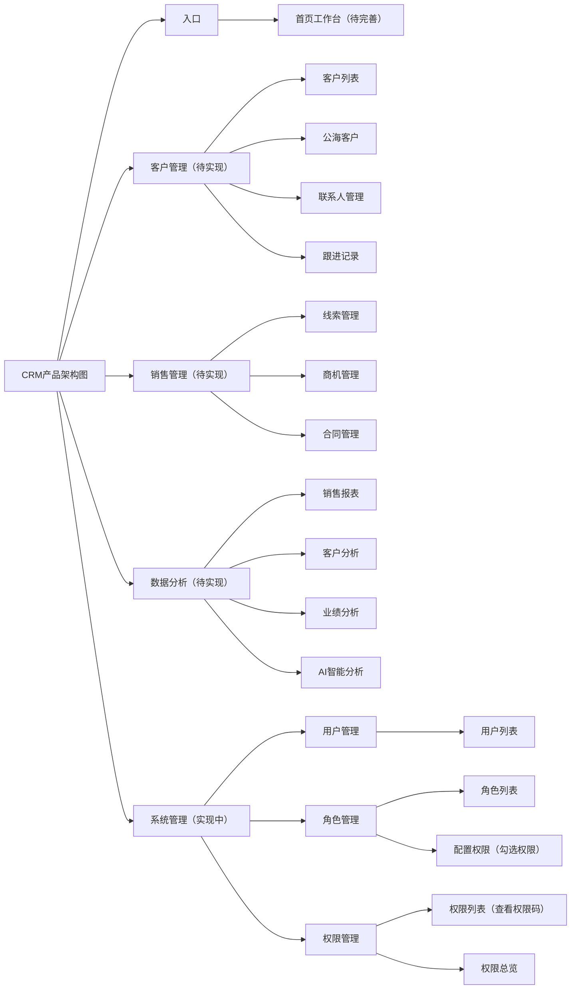

# CRM产品架构图

```mermaid
graph LR
    CRM[CRM产品架构图]

    CRM --> A[入口]
    A --> A1[首页工作台（待完善）]

    CRM --> B[客户管理（待实现）]
    B --> B1[客户列表]
    B --> B2[公海客户]
    B --> B3[联系人管理]
    B --> B4[跟进记录]

    CRM --> C[销售管理（待实现）]
    C --> C1[线索管理]
    C --> C2[商机管理]
    C --> C3[合同管理]

    CRM --> D[数据分析（待实现）]
    D --> D1[销售报表]
    D --> D2[客户分析]
    D --> D3[业绩分析]
    D --> D4[AI智能分析]

    CRM --> E[系统管理（实现中）]
    E --> E1[用户管理]
    E1 --> E11[用户列表]

    E --> E2[角色管理]
    E2 --> E21[角色列表]
    E2 --> E22[配置权限（勾选权限）]

    E --> E3[权限管理]
    E3 --> E31[权限列表（查看权限码）]
    E3 --> E32[权限总览]
```
